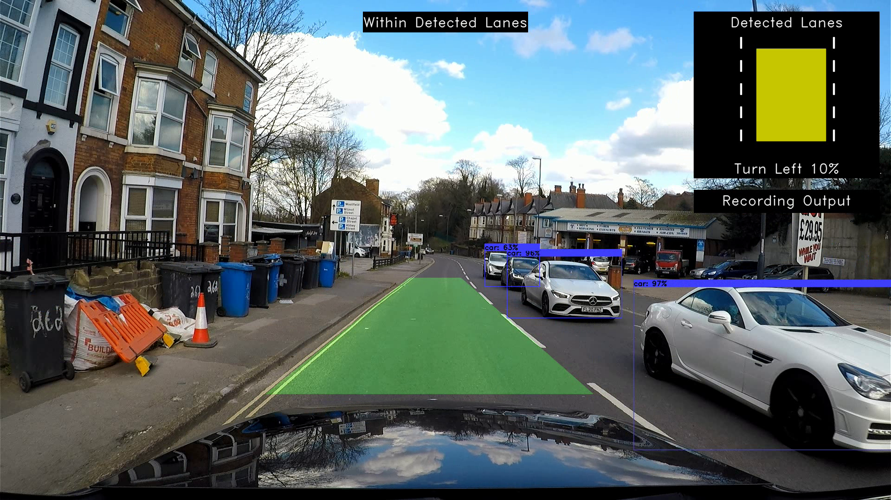
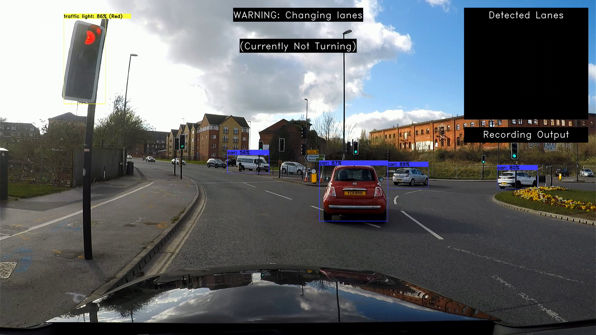
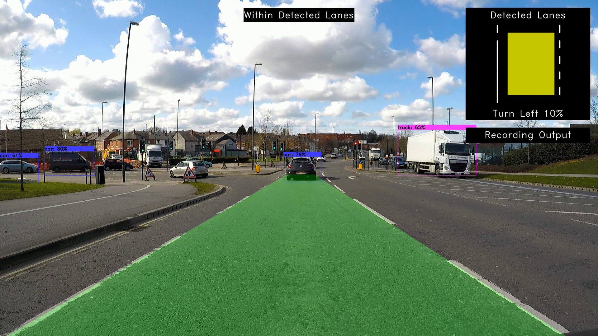
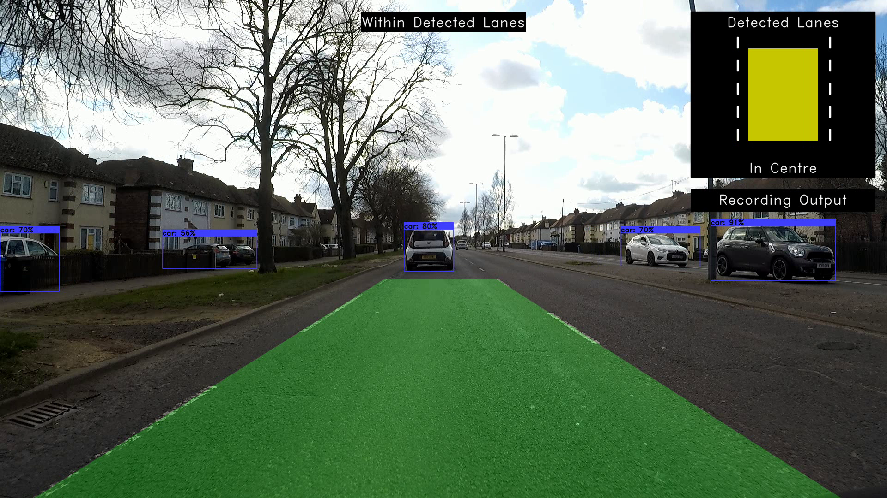
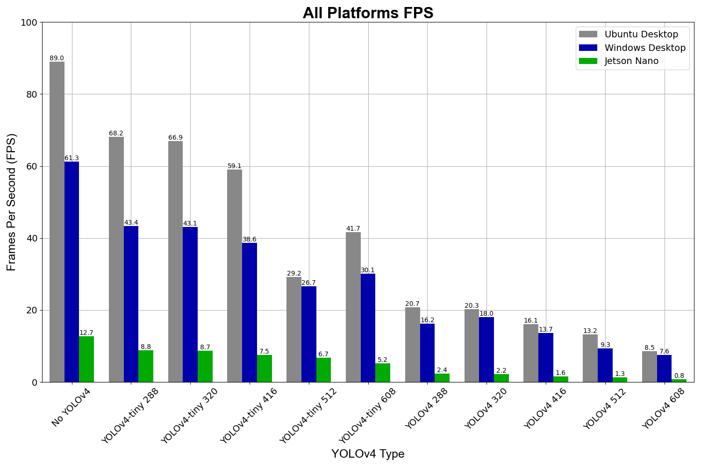

# YouTube Playlist
It can be found [here](https://youtube.com/playlist?list=PLFJGOGaRWoxDm-Em5-mNv7JbYHmCRMm9b) and each video has a description with an explanation

# Screenshots from the Real World Test
<p align="center">  </p>
<p align="center">  </p>
<p align="center">  </p>
<p align="center">  </p>


# Performance of the Software
<p align="center">  </p>
<h4 align="center">
  Desktop = Ryzen 5800x, GTX 960 4 GB, and 32 GB RAM

  Jetson Nano = Jetson Nano 4 GB (B01 Model)
</h4>

# Components used in the final software-hardware package:
* Jetson Nano 4 GB (B01 Model)
* HDMI cable for Jetson Nano output
* Micro-USB cable or barrel plug for power
* 64 GB Micro SD Card
* Wi-Fi Card (or use ethernet port)
* Camera:
  * GoPro Hero 5 Black
  * Suction Mount
  * micro HDMI to HDMI cable
  * HDMI to USB video capture device
  * Changed GoPro 'HDMI output' setting to 'Live'
* Waveshare Metal Case for the Jetson Nano
* Keyboard & Mouse

# Instructions for Setting up Windows 10 (1.5hrs)
0. Download all pre-requisites
    * Microsoft Visual Studio
    * CMake (Add to PATH)
    * CUDA 11.2
    * cuDNN 8.1.1

1. Download OpenCV 4.5.1 and OpenCV-contrib 4.5.1, unzip them, and create a build folder in the same directory

2. Open the CMake GUI and select the unzipped OpenCV 4.5.1 as source directory and the build folder as the build directory and select Microsoft Visual Studio as the compiler

3. Press configure and change:
    * BUILD_opencv_world=ON
    * OPENCV_EXTRA_MODULES_PATH to the modules folder in the unzipped OpenCV-contrib 4.5.1
    * WITH_CUDA=ON
    * OPENCV_DNN_CUDA=ON
    * ENABLE_FAST_MATH=ON
    * WITH_TBB=ON
    * OPENCV_ENABLE_NONFREE=ON

4. Press configure again and change:
    * CUDA_FAST_MATH=ON
    * For your GPU set the correct GPU arch number and GPU family name

5. Press configure, then generate, then open project

6. Build the BUILD and INSTALL solutions

7. For each Microsoft Visual Studio project, go to project properties:
    * VC++ directories
      * Include Directories
        * add {Path to build folder}\install\include
        * add C:\Program Files\NVIDIA GPU Computing Toolkit\CUDA\v11.2\include
      * Library Directories
        * add {Path to build folder}\install\x64\vc16\lib
        * add C:\Program Files\NVIDIA GPU Computing Toolkit\CUDA\v11.2\lib\x64
    * Linker
      * Additional Dependencies
        * add opencv_world451.lib
        * add cudart.lib

# Instructions for Setting up the Jetson Nano (4hrs) / Ubuntu Desktop (1.5hrs)

0. Setup Jetson Nano (Skip for Ubuntu Desktop)
    * Download NVIDIA Jetpack SDK 4.5.1 from https://developer.nvidia.com/embedded/jetpack
    * Format and flash SD card with the downloaded file
      * `Formatter` = https://www.sdcard.org/downloads/formatter/sd-memory-card-formatter-for-windows-download/
      * `Flasher` = https://www.balena.io/etcher/
    * Boot up Jetson Nano and follow the Welcome prompts (make sure to choose MAXN mode)

### Open up the terminal and execute the following:
1. Download all pre-requisites and press enter whenever asked to continue: (OK if python wheels fails)

       sudo apt upgrade && sudo apt update && sudo apt install build-essential cmake pkg-config unzip yasm git checkinstall && sudo apt install libjpeg-dev libpng-dev libtiff-dev && sudo apt install libavcodec-dev libavformat-dev libswscale-dev libavresample-dev && sudo apt install libgstreamer1.0-dev libgstreamer-plugins-base1.0-dev && sudo apt install libxvidcore-dev x264 libx264-dev libfaac-dev libmp3lame-dev libtheora-dev && sudo apt install libfaac-dev libmp3lame-dev libvorbis-dev && sudo apt install libopencore-amrnb-dev libopencore-amrwb-dev && sudo apt-get install libdc1394-22 libdc1394-22-dev libxine2-dev libv4l-dev v4l-utils && cd /usr/include/linux && sudo ln -s -f ../libv4l1-videodev.h videodev.h && cd ~ && sudo apt-get install libgtk-3-dev && sudo apt-get install libtbb-dev && sudo apt-get install libatlas-base-dev gfortran && sudo apt-get install libprotobuf-dev protobuf-compiler && sudo apt-get install libgoogle-glog-dev libgflags-dev && sudo apt-get install libgphoto2-dev libeigen3-dev libhdf5-dev doxygen && sudo apt-get install python3-dev python3-pip && sudo -H pip3 install -U pip numpy && sudo apt install python3-testresources


2. Add CUDA to the path (Ubuntu desktop will need to install CUDA and add it to the PATH)

       echo 'export PATH=/usr/local/cuda/bin${PATH:+:${PATH}}' >> ~/.bashrc && \
       echo 'export LD_LIBRARY_PATH=/usr/local/cuda/lib64${LD_LIBRARY_PATH:+:${LD_LIBRARY_PATH}}' >> ~/.bashrc


3. Download jtop to enable jetson_clocks, adjust fan speed, and much more (Skip for Ubuntu Desktop)

       sudo -H pip install -U jetson-stats && \
       sudo systemctl restart jetson_stats.service && \
       sudo reboot

4. cd to Downloads, then download OpenCV and OpenCV-contrib, then unzip both, then create and cd into build folder:

       cd ~/Downloads && \
       wget -O opencv.zip https://github.com/opencv/opencv/archive/4.5.1.zip && \
       wget -O opencv_contrib.zip https://github.com/opencv/opencv_contrib/archive/4.5.1.zip && \
       unzip opencv.zip && \
       unzip opencv_contrib.zip && \
       mkdir build && cd build

5. Build OpenCV with CUDA (For the Jetson Nano make sure there is an extra 4 GB (so total 6 GB) of swap memory using jtop and then remove after compilation)

       cmake \
       -D CMAKE_BUILD_TYPE=RELEASE \
       -D CMAKE_INSTALL_PREFIX=/usr/local \
       -D WITH_TBB=ON \
       -D WITH_CUDA=ON \
       -D OPENCV_DNN_CUDA=ON \
       -D CUDA_ARCH_BIN=5.3 \
       -D ENABLE_FAST_MATH=1 \
       -D CUDA_FAST_MATH=1 \
       -D WITH_CUBLAS=1 \
       -D WITH_V4L=ON \
       -D WITH_OPENGL=ON \
       -D WITH_GSTREAMER=ON \
       -D OPENCV_GENERATE_PKGCONFIG=ON \
       -D OPENCV_PC_FILE_NAME=opencv.pc \
       -D OPENCV_ENABLE_NONFREE=ON \
       -D OPENCV_EXTRA_MODULES_PATH=/home/main/Downloads/opencv_contrib-4.5.1/modules \
       ../opencv-4.5.1 && \
       make -j4 && \
       sudo make install -j4 && \
       sudo sh -c 'echo "/usr/local/lib" > /etc/ld.so.conf.d/opencv.conf' && \
       sudo ldconfig

# WARNING
The yolo4.weights file could not be uploaded due to GitHub's 100 MB upload limit but can be downloaded from [here](https://github.com/AlexeyAB/darknet/releases/download/darknet_yolo_v3_optimal/yolov4.weights) and should be copied to the `yolo` folder.

# Running the software
0. Assuming that you are in the Third-Year-Project/code folder

1. Run release.cpp with motorway.mp4 vid (For windows make sure x64 and release settings have been selected and hit F5 to run)

    **Jetson Nano/Ubuntu**

       g++ release.cpp RollingAverage.cpp -O3 -o YOLO_release.out `pkg-config opencv --cflags --libs` && \
       ./YOLO_release.out

    **Windows 10**
    * Create a Microsoft Visual Studio project
    * Add `release.cpp`, `RollingAverage.h` and `RollingAverage.cpp`
    * Do step 7 for 'Instructions for Setting up Windows 10'

2. If webcam output desired, then change line 15 in release.cpp from (However, make sure the lane is within the ROI frame, which is in the centre of the frame and slightly down):

   ```c++
   cv::VideoCapture inputVideo("../resources/motorway.mp4");` to `cv::VideoCapture inputVideo(0);
   ```

3. Or debug.cpp can be used to adjust the ROI position by running the following:

    **Jetson Nano/Ubuntu**

       g++ debug.cpp RollingAverage.cpp -O3 -o YOLO_debug.out `pkg-config opencv --cflags --libs` && \
       ./YOLO_debug.out

    **Windows 10**
    * Create a Microsoft Visual Studio project
    * Add debug.cpp, RollingAverage.h, RollingAverage.cpp
    * Do step 7 for 'Instructions for Setting up Windows 10'

    **Jetson Nano/Ubuntu and Windows 10**
    * Then grab a screenshot with 's' key pressed (file will be in media folder)
    * Then change desired screenshot name to '0.png'
    * Then change editROIUsingImage = false on line 34 in debug.cpp to true
    * Then change ROI parameters until ROI frame contains only lane information
    * Then copy these ROI parameters to the release.cpp constants
    * Then re-compile and run release.cpp using step 1
    * Make sure camera position does not move

4. Expected performance in release.cpp should be around 0.8 FPS but to increase this to 8.8 FPS:
    * Change line 62 from
        ```c++
        cv::dnn::Net net = cv::dnn::readNetFromDarknet("../yolo/yolov4.cfg", "../yolo/yolov4.weights");
        ```
        to the following
        ```c++
        cv::dnn::Net net = cv::dnn::readNetFromDarknet("../yolo/yolov4-tiny.cfg", "../yolo/yolov4-tiny.weights");
        ```
    * Reduce blob size from 608 to 288 on line 110 from
        ```c++
        constexpr int m_BlobSize = 608;
        ```
        to the following
        ```c++
        constexpr int m_BlobSize = 288;
        ```

# Difference Between Third-Year-Project
* No thesis.pdf
* Source code refactored into an OOP style
* Repository directory structure re-organised
* MATLAB scripts replaced with python
