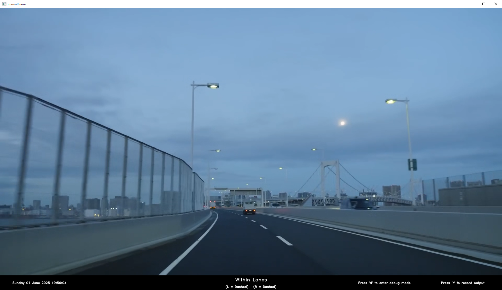

# Lane and Object Detection

Lane and object detection for use in autonomous vehicles using OpenCV and YOLOv7.

## Getting Started

Binaries can be found in [Releases][releases] or, if preferred, CMake can be used to build the project from source either
through the PowerShell helper module:

> [!IMPORTANT]
> Make sure to download the [`yolov7.weights`][yolov7-weights] file into the `./resources/yolo/` folder and included in the
> repository is a `benchmark.mp4` file which can be used to run the program against.

```text
Import-Module ./modules/Build.psd1;

Build-CppCodeUsingCMake -Platform windows-latest -BuildType Release -BuildDirectory build -Parallel 8 -Verbose;

./build/lane-and-object-detection/lane-and-object-detection -i ./tests/performance_tests/benchmark.mp4 -y ./resources/yolo/
```

or manually:

```text
git clone --recurse-submodules https://github.com/J-Afzal/Lane-and-Object-Detection.git
cd Lane-and-Object-Detection

# Build OpenCV
cd ./submodules/opencv/
cmake -S . -B ./build -D "CMAKE_BUILD_TYPE=Release" -D "BUILD_opencv_world=ON"
cmake --build ./build --config Release --parallel 8
cd ../..

# Build Lane and Object Detection
cmake -S . -B ./build -D "CMAKE_BUILD_TYPE=Release"
cmake --build ./build --config Release --parallel 8

# The `yolov7.weights` file could not be uploaded due to GitHub's 100 MB upload limit, but is included as a download step for
# both the PowerShell helper module and these manual instructions
curl -L -o .\resources\yolo\yolov7.weights "https://github.com/AlexeyAB/darknet/releases/download/yolov4/yolov7.weights"

./build/lane-and-object-detection/lane-and-object-detection -i ./tests/performance_tests/benchmark.mp4 -y ./resources/yolo/
```

> [!WARNING]
> If on Windows make sure to run the above within a Visual Studio Developer Command Prompt otherwise you may see errors around
> `cl.exe` not being found. Also, if on Windows make sure to add -G "NMake Makefiles" otherwise the required dlls may not be in
> the expected locations for the above instructions.

Here are the full list of options for Lane and Object Detection:

```plain
Usage: lane-and-object-detection --input ... --yolo-folder-path ... [optional]

OPTIONS:

Generic Options:

  -h --help                       Display available options.

Required Options:

  -i --input                      File path or camera ID
  -y --yolo-folder-path           Path to the yolo folder

Optional options:

  -o --object-detector-type       One of: none, standard or tiny. (default = none)
  -b --object-detector-backend    One of: cpu, gpu or cuda (default = cpu)
  -s --object-detector-blob-size  One of: 208, 320, 416, 512 or 608 (default = 208)
```

> [!NOTE]
> CUDA is supported by OpenCV but would require a CUDA enabled OpenCV installation which both the PowerShell helper module and
> the manual instructions don't do.

## Documentation

Checkout the [documentation page][docs] built using Doxygen and hosted using Github pages.


## General Information

This program uses YOLOv7 for object detection and OpenCV for lane detection. OpenCV is also used for handling IO such as reading
and writing video file as well as display the output to a window.

The object detection is able to detect most road-related objects such as cars, buses, trucks, cyclists, pedestrians, traffic
lights, etc. The accuracy and speed of detection is dependent upon the available GPU compute. For higher quality detection
select a higher blob size. For more performant detection select a lower blob size, and/or select the tiny detector type and/or
GPU backend. For maximum performance the CUDA backend should be used, however, this requires building OpenCV with CUDA which is
not supported with this projects built-in installation script.

The lane detection code is custom made for this program. The one sentence summary would be that it: creates an ROI frame to
isolate the road markings immediately in front of the car, runs the Canny algorithm to retrieve the edges, runs the Hough
transform to get the straight lines, de-noises and categorises the straight lines to determine the location of the current lane.

The program has two modes:

1. `Normal Mode` which only displays the current driving state and the detected left and right lane line types:

    

1. `Debug Mode` which additionally displays the current FPS, average FPS and the ROI, Canny and Hough intermediary frames.

    

Both modes support recording the output of the main frame.


Pressing `q` will quit the program.

### Performance Tests

The project includes performance testing and graphing capability to test the FPS across the blob sizes and yolo types.

Build the C++ code as mentioned in [Getting Started](./#getting-started) and run the performance tests (replace
`<<platform name>>`) which will output their results into a SQLite database file:

```plain
./build/lane-and-object-detection-performance-tests `
    -p <<platform name>> `
    -d sqlite-<<platform name>>.db `
    -i ./tests/performance_tests/benchmark.mp4 `
    -y ./resources/yolo/ `
    -r 1;
```

Install the python dependencies and run the performance graph generation:

```plain
python -m venv .venv/
.\.venv\Scripts\activate
pip install -r ./requirements.txt

python -m ./tests/main.py `
    -d ./sqlite-<<platform name>>.db `
    -o ./tests/performance_graphs/output/
```

> [!NOTE]
> Creating comparison graphs between platforms is supported by passing a comma separated list of SQLite database file paths.

<!-- TODO: example screenshot of graphs for both single platform and multiple platform-->
<!-- TODO: test CD before merging (edit to be draft release) -->

## CI / CD

[![Continuous Integration][ci-badge]][ci-page] [![Continuous Deployment][cd-badge]][cd-page]

The continuous integration workflow runs against all commits on pull requests, builds the code, runs unit tests and performs
linting checks.

The continuous deployment workflow runs against all commits to main, builds the code and deploys the executables as a release.

## Development Setup

For development a few extra tools are needed to check for linting issues locally which include the [Linters][linters-repo] and
[OpenCV][opencv-repo] submodules:

```text
git clone --recurse-submodules https://github.com/J-Afzal/Lane-and-Object-Detection.git
```

The development dependencies are:

- Git
- PowerShell version >= 5
- npm dependencies via `npm install`
- clang-tidy >= 19 and clang-format >= 19
- CMake >= 3.20
- Ninja >= 1.12.1

All linting helper functions can be found in the [Linters][linters-repo] submodule.

Any generator can be used to build the project but to prior to running `clang-tidy`/`clang-format` CMake must be configured
using a generator that creates a `compile_commands.json` file in the build directory (e.g. `-G "Ninja"`, `-G "NMake Makefiles"`,
etc)

On windows, clang-tidy and clang-format can be installed using the `LLVM-x.x.x-win64.exe` binary from the
[LLVM release page][llvm-release-page] or from [chocolatey][llvm-chocolatey] using `choco install llvm -y`.

### IDE

On Windows, Visual Studio 2022 can be used by opening the folder as a CMake project and Visual Studio Code can be used by
opening the folder through the `Developer PowerShell for VS` (otherwise you may see errors around cl.exe not being found).

<!-- Link References -->

[releases]: https://github.com/J-Afzal/Lane-and-Object-Detection/releases
[yolov7-weights]: https://github.com/AlexeyAB/darknet/releases/download/yolov4/yolov7.weights
[docs]: https://J-Afzal.github.io/Lane-and-Object-Detection
[ci-badge]: https://github.com/J-Afzal/Lane-and-Object-Detection/actions/workflows/ContinuousIntegration.yml/badge.svg
[ci-page]: https://github.com/J-Afzal/Lane-and-Object-Detection/actions/workflows/ContinuousIntegration.yml
[cd-badge]: https://github.com/J-Afzal/Lane-and-Object-Detection/actions/workflows/ContinuousDeployment.yml/badge.svg
[cd-page]: https://github.com/J-Afzal/Lane-and-Object-Detection/actions/workflows/ContinuousDeployment.yml
[linters-repo]: https://github.com/J-Afzal/Linters
[opencv-repo]: https://github.com/opencv/opencv
[llvm-release-page]: https://github.com/llvm/llvm-project/releases/tag/llvmorg-19.1.6
[llvm-chocolatey]: https://community.chocolatey.org/packages/llvm

<!-- Add release checks to terminal games -->
